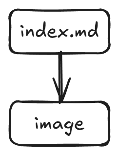

# Start here

A comprehensive guide to markdown formatting.

---

## Quick Navigation

Here is a list

- [About-with-link](about.md)
- [About]
- [Duck.ai](http://duck.ai)

---

## Headers

Headers range from H1 to H6, providing a clear document structure.

### H3 - Section Header

H3 headers are typically used for main sections.

#### H4 - Subsection Header

H4 headers organize content within sections.

##### H5 - Minor Header

H5 headers are for subsection details.

###### H6 - Smallest Header

H6 is the smallest heading level.

---

## Text Formatting

Text can be **bold**, *italic*, or ***bold and italic*** combined.

You can also use ~~strikethrough~~ text for deleted content.

Use `inline code` for short code snippets within text.

---

## Lists

### Unordered Lists

Create bullet point lists:

- First item
- Second item
- Third item
  - Nested item 1
  - Nested item 2

### Ordered Lists

Numbered lists for step-by-step instructions:

1. First step
2. Second step
3. Third step

---

## Tables

### Basic Table

| id   | name        |   price |
|:-----|:-----------:|--------:|
| 10   | Rubber Duck | 1.99    |
| 11   | Dino Toy    | 9.95    |

### Feature Comparison

| Feature       | Basic Plan | Pro Plan | Enterprise |
|---------------|------------|----------|------------|
| Storage       | 10 GB      | 100 GB   | Unlimited  |
| Users         | 1          | 10       | Unlimited  |
| Support       | Email      | Priority | 24/7       |
| Price         | $9/mo      | $29/mo   | Custom     |

### Code Reference Table

| Syntax        | Description | Example |
|---------------|-------------|---------|
| `# Header`    | H1 header   | `# Title` |
| `## Header`   | H2 header   | `## Section` |
| `**bold**`    | Bold text   | `**important**` |
| `*italic*`    | Italic text | `*note*` |

---

## Code

### Inline Code

Use backticks for inline code: `const greeting = "Hello, World!";`

### Code Blocks

```javascript
function greet(name) {
  return `Hello, ${name}!`;
}

const message = greet("World");
console.log(message);
```

### Python Code Block

```python
def fibonacci(n):
    if n <= 0:
        return []
    elif n == 1:
        return [0]
    
    sequence = [0, 1]
    while len(sequence) < n:
        sequence.append(sequence[-1] + sequence[-2])
    return sequence

print(fibonacci(10))
```

### HTML Code Block

```html
<!DOCTYPE html>
<html lang="en">
<head>
    <meta charset="UTF-8">
    <title>Example Page</title>
</head>
<body>
    <h1>Hello World</h1>
    <p>This is a sample paragraph.</p>
</body>
</html>
```

---

## Blockquotes

> This is a blockquote. It's used to quote text from another source or to highlight important information.

> Multiple lines of text can be quoted together. This is useful for displaying dialogues or lengthy citations.

> > Nested blockquotes are also possible for multi-level quotations.

---

## Links

### External Links

- [Duck.ai](http://duck.ai) - AI-powered search engine
- [Wikipedia](https://www.wikipedia.org) - The Free Encyclopedia


### Email Links

Contact us at: [hello@example.com](mailto:hello@example.com)

---

## Images

### Local Image



---

## Horizontal Rules

You can separate content with horizontal rules:

---

Or using asterisks:

***

Or using dashes:

---

---

## Tables with Mixed Content

| Element       | Type        | Usage Example |
|---------------|-------------|---------------|
| Paragraph     | Block       | `<p>Content</p>` |
| Link          | Inline      | `<a href="url">Text</a>` |
| Image         | Inline      | `` |
| List          | Block       | `<ul><li>Item</li></ul>` |
| Table         | Block       | `<table>...</table>` |
| Blockquote    | Block       | `<blockquote>...</blockquote>` |

---

## Miscellaneous Examples

### Emojis

You can include emojis: 🎉 🚀 💡 📝 ✅

### Superscript and Subscript

Use superscript: X² + Y² = Z²

Use subscript: H₂O (water formula)

### Abbreviations

HTML is the standard markup language for creating web pages.
CSS is used to style web pages.
JS (JavaScript) adds interactivity to websites.

---

## Conclusion

This page demonstrates the various markdown formatting options available. Use these examples as a reference when writing documentation, creating README files, or formatting content for your projects.

**Happy Writing!** 📝